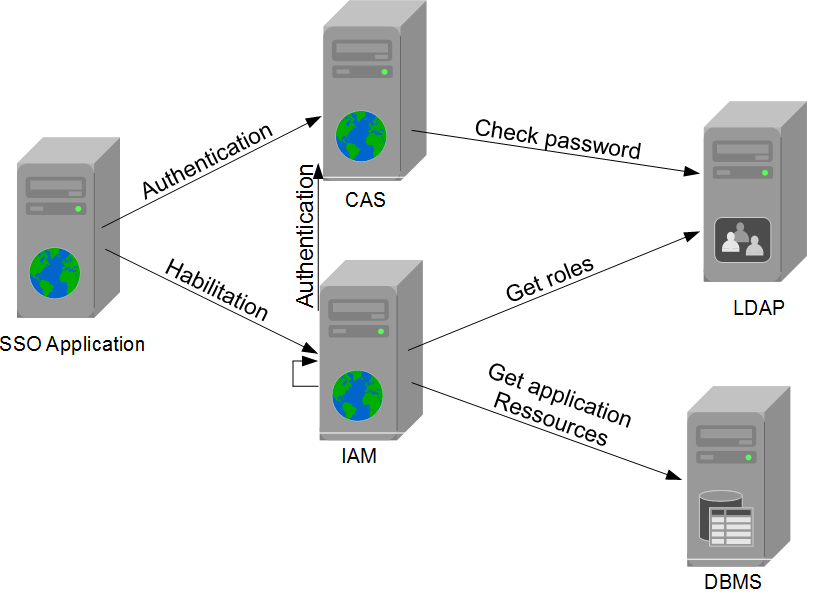
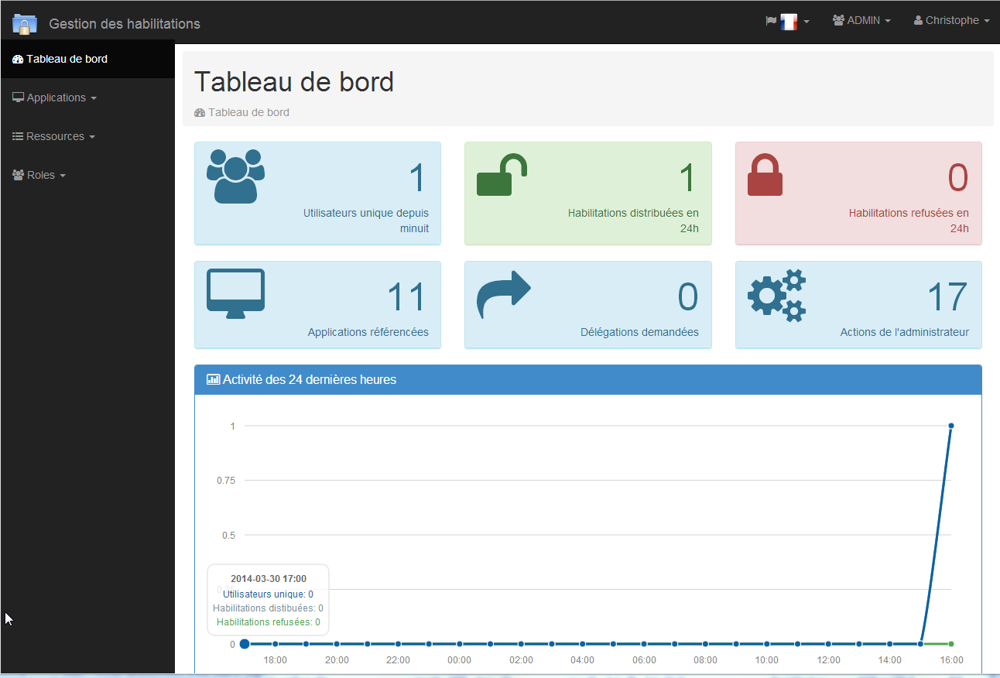
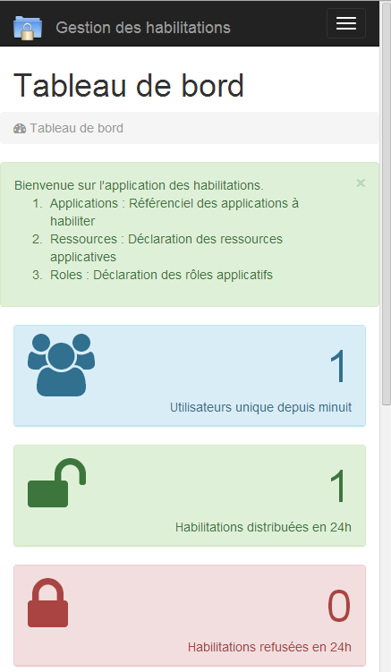
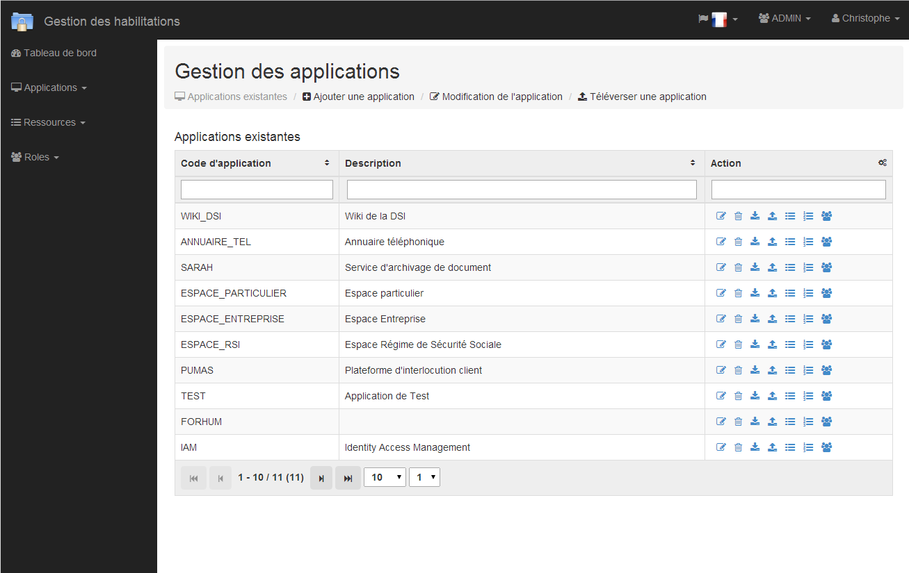
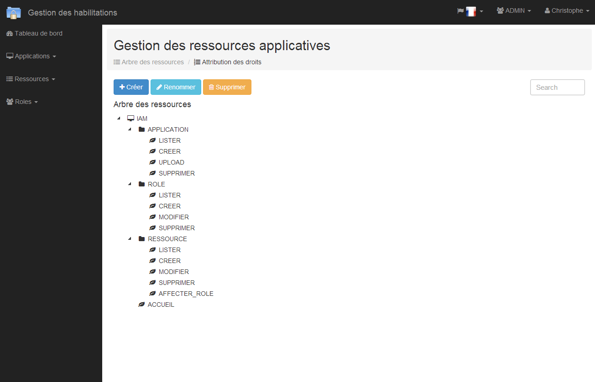
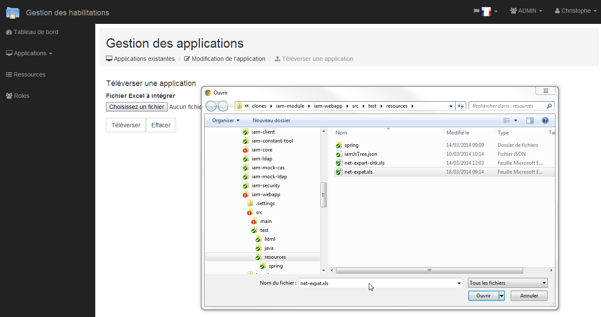
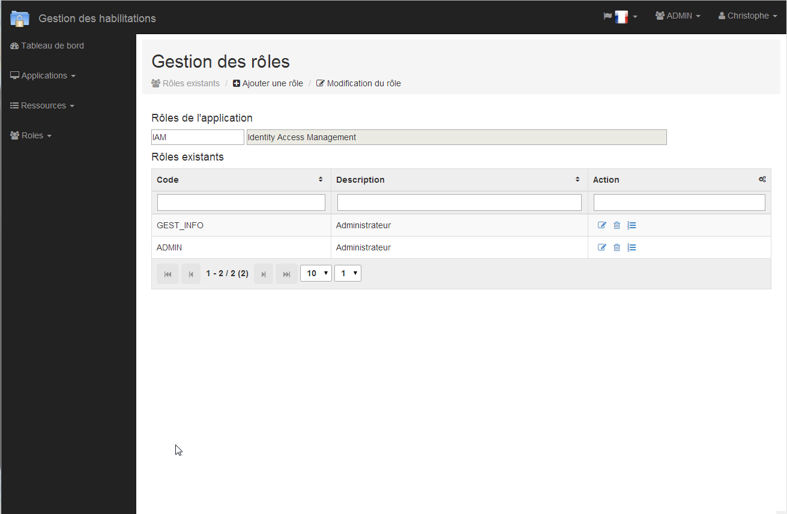
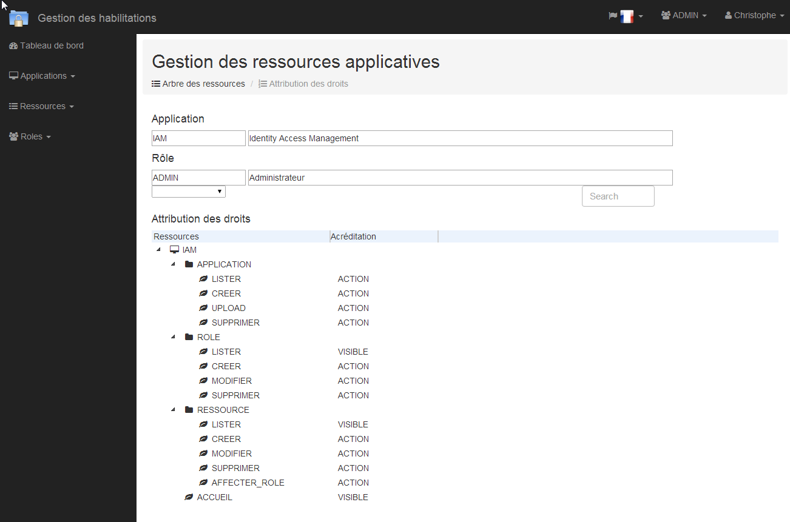

iam-module
===================

[](https://www.codacy.com/app/cunvoas/springsecurity_iam?utm_source=github.com&utm_medium=referral&utm_content=cunvoas/springsecurity_iam&utm_campaign=badger)

This application implements Identity Access Management (IAM) oriented by business user approach. It is light compared to real IAM solution.

It is inspired from few years experience with Role Management applied on development, integration and maintenance. And the energy lost by changing code, role extentions, testing. 
With this implementation, the application is securised by applicative ressource.

The Access Control List (ACL) is the core of the system with a tree that describe your application. The tree will be created by following the Use Case from UML analysis or the navigation tree.

The implementation of the tree has chose to be fast to read with only one SQL query.
The leaf of the tree, called resource in my IAM implementation, provides the habilitation information by role.

The infrastucture scheme is the following :


The application is ready to be released for IAM basics.
For the next steps :
* Delegation of roles is on study.
* Non-repudiation of actions is an idea.


The module iam-webapp-sample is a sample of IAM integration.

How to integrate IAM in a webapp ?
* Include IAM dependencies : pom.xml
```XML
	<dependency>
		<groupId>com.github.cunvoas</groupId>
		<artifactId>iam-security</artifactId>
		<version>0.0.1</version>
	</dependency>
```

* Configure IAM attribute : iam.properies
```INI
    # URL from the IAM webservice
    iamWebServiceURL=http://localhost:8080/iam-webapp/services/iam/soap
    # Code for your application
    iamCodeApplication=IAM
```

* Constants keys generated by iam-constant-tool artifact.
```Java
	public abstract class IamKeys {

		public static final String INVISIBLE = IamHelper.INVISIBLE;
		public static final String VISIBLE = IamHelper.VISIBLE;
		public static final String ACTION = IamHelper.ACTION;
		
		/**
		 * Access keys to ACCUEIL items.
		 */
		public static final String IAM_ACCUEIL = "IAM.ACCUEIL";

		/**
		 * Access to APPLICATION items.
		 */
		public static final String IAM_APPLICATION_LISTER = "IAM.APPLICATION.LISTER";
		public static final String IAM_APPLICATION_CREER = "IAM.APPLICATION.CREER";
		public static final String IAM_APPLICATION_MODIFIER = "IAM.APPLICATION.MODIFIER";
		public static final String IAM_APPLICATION_SUPPRIMER = "IAM.APPLICATION.SUPPRIMER";
		public static final String IAM_APPLICATION_UPLOAD = "IAM.APPLICATION.UPLOAD";
```

* Import in spring configuration file
```XML
	<!-- IAM Capabilities -->
	<import resource="classpath:spring/spring-security-iam-remote.xml" />
	
	<!-- set the UserDetailService in CasAuthenticationProvider  -->
	<bean id="casAuthenticationProvider" class="org.springframework.security.cas.authentication.CasAuthenticationProvider">
	<property name="authenticationUserDetailsService">
		<bean class="org.springframework.security.core.userdetails.UserDetailsByNameServiceWrapper">
			<!-- IAM Security @see spring File: iam-security/spring/spring-security-iam.xml -->
			<constructor-arg ref="iamUserDetailsService" />
		</bean>
		...
	</bean>
```

* Usage in controllers
```Java
	// URL Mapping
	@RequestMapping(value = "/list", method = RequestMethod.GET)
	// IAM Annotation
    @SecuredIam(vectorKey = IamKeys.IAM_APPLICATION_LISTER, vectorValue = IamKeys.VISIBLE)
    public ModelAndView findAll(HttpServletRequest request, HttpServletResponse response, ModelMap model) {
		// controller code here
        return new ModelAndView(Constants.VIEW_APPLICATION_LIST);
    }
```

* Usage in views
```Java
	<%@ taglib prefix="security" uri="http://www.springframework.org/security/tags" %>
  
	<security:accesscontrollist domainObject="${IamKeys.IAM_ACCUEIL}" hasPermission="${IamKeys.VISIBLE}" >
		<div>html content here</div>
	</security:accesscontrollist>
```

Screen Capture :
* Dashboard


* Web Responsive


* Application List


* Resource Tree of an Application


* Push Configuration from Excel File by upload


* Roles of an application


* Credential setup



